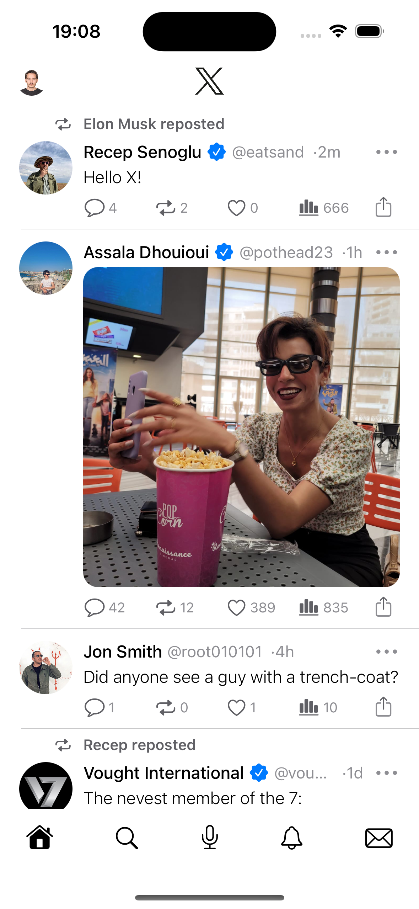
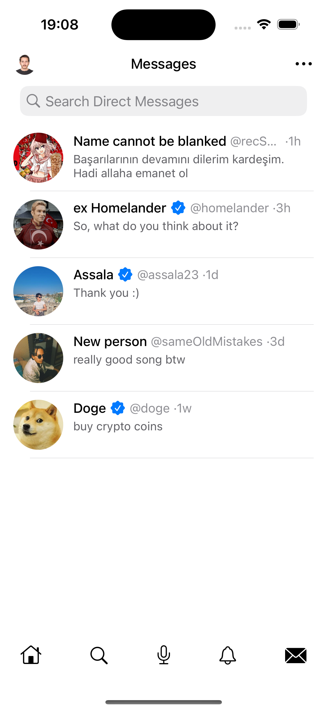

#  X App UI Clone (Twitter)

This is a clone of the Twitter app UI, made with **Swift** & **Storyboard**. It's a simple app that shows the main features of the Twitter app. 

## Technologies

- Xcode 15.0.1
- Swift 5.9
- Storyboard
- UIKit
- SourceControl (Git)

## Screenshots

Home...... | Messages | Preview
------------ | ------------- | -------------
 |  | 

## Contributing

We welcome contributions to this project! Please follow these guidelines:

    Fork the repository on GitHub
    Create a new branch for your changes
    Make your changes and commit them to your branch
    Submit a pull request to the main branch

## License

This project is licensed under the MIT license. See the [LICENSE](LICENSE) file for more info.

